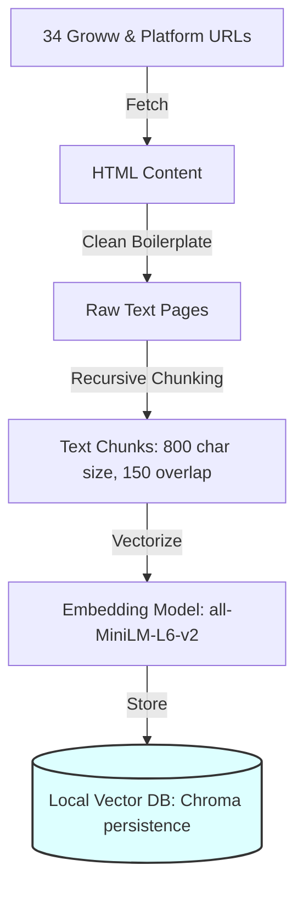
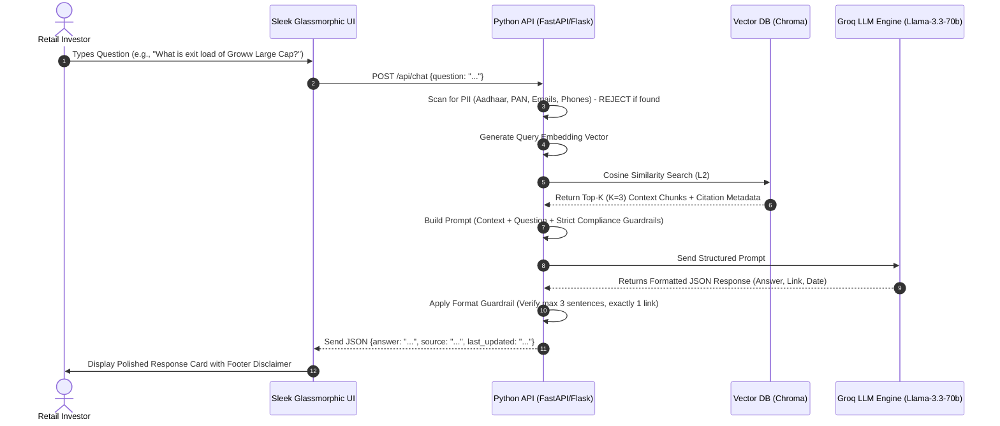

# System Architecture: Mutual Fund FAQ Assistant (RAG Pipeline)

This document outlines the detailed system architecture, pipeline workflows, technology stack, and engineering choices for the **Retrieval-Augmented Generation (RAG)-based Mutual Fund FAQ Assistant**. 

---

## 🏛️ System Overview

The system is designed as a lightweight, compliant, and highly accurate facts-only financial Q&A application. It is divided into two primary pipelines:
1. **Offline Document Indexing Pipeline**: Crawls, clean, chunks, embeds, and indexes the official mutual fund scheme documents.
2. **Online Query & Retrieval Pipeline**: Handles user questions, queries the vector database using Approximate Nearest Neighbor (ANN) search, feeds the context to the LLM under strict guardrails, and renders a response to the user.

```
+-----------------------------------------------------------------------------------+
|                            OFFLINE INDEXING PIPELINE                              |
|                                                                                   |
|  [34 Scheme URLs] --> [Web Crawler] --> [Text Cleaner] --> [Semantic Chunker]     |
|                                                                    |              |
|  [Vector Database (ChromaDB)] <--------- [Embedding Generator] <---+              |
+-----------------------------------------------------------------------------------+
                                          |
                                          | (Indexed Context Store)
                                          v
+-----------------------------------------------------------------------------------+
|                             ONLINE QUERY PIPELINE                                 |
|                                                                                   |
|  [User Question] ----------> [Query Embedder]                                     |
|       |                              |                                            |
|       |                              v                                            |
|       |                      [Similarity Search]                                  |
|       |                              |                                            |
|       |                              v                                            |
|       |                    [Top-K Context Chunks]                                 |
|       |                              |                                            |
|       v                              v                                            |
|  [Input Sanitizer] ---> [Prompt Constructor]                                      |
|                               |                                                   |
|                               v                                                   |
|                         [Groq LLM Engine]                                         |
|                               |                                                   |
|                               v                                                   |
|                       [Format Guardrail]                                          |
|                               |                                                   |
|                               v                                                   |
|                      [Polished UI Client] <--- (Max 3 Sentences + 1 Link + Date)  |
+-----------------------------------------------------------------------------------+
```

---

## 🛠️ Key Architectural Components

### 1. Document Ingestion & Processing (Offline)
The ingestion subsystem is responsible for creating a clean, structured vector representation of the mutual fund corpus.

* **Target Corpus**: 34 designated mutual fund URLs (23 Groww schemes + 11 highly queried platform schemes).
* **Ingestion Worker**: 
  * Fetches the web pages using a custom scraping script (`HTTP GET` requests with browser-like header emulation to bypass basic scrape protection).
  * Strips out boilerplate HTML tags, navbars, footers, scripts, and promotional banners to extract high-density text (e.g. using `BeautifulSoup` or `Markdownify`).
* **Chunking Strategy**: 
  * Uses a **Recursive Character Text Splitter** with a target chunk size of **800 characters** and an overlap of **150 characters**.
  * Ensures that logical formatting boundaries (paragraphs, bullet points, scheme table rows) are preserved and not split awkwardly.
* **Daily Ingestion Scheduler**:
  * An automated scheduler (implemented via `APScheduler` or native `cron`) triggers the crawl and ingestion pipeline **daily at 00:00 UTC**.
  * Implements incremental updates: compares document hashes/checksums to download only modified URLs, parsing new data and updating vector embeddings in the local vector DB to ensure NAV, scheme rules, and fund manager details are continuously updated.

### 2. Embedding Layer & Vector Storage (Offline)
* **Embedding Model**: `all-MiniLM-L6-v2` or `text-embedding-3-small` (depending on API budget). 
  * Generates high-density **384-dimensional** or **1536-dimensional** vector embeddings.
* **Vector Store**: **ChromaDB** or **FAISS** (Local, file-backed).
  * Lightweight, requires zero infrastructure overhead.
  * Supports fast L2 distance/Cosine Similarity search.
  * Persistence is established in the workspace local directory (`data/vector_db/`).



---

## ⚡ Runtime Retrieval & Generation Pipeline (Online)

When a user submits a question through the interface, the query orchestrator executes the following high-speed pipeline:



---

## 🚫 Guardrail & Compliance Subsystem

Maintaining compliance with financial guidelines is a core design criterion. The architecture includes **three layers of protection**:

### Layer 1: Input PII Filter
Before any query goes to the retrieval database or LLM, a regex-based **PII Anonymization Filter** scans the input. Any request containing patterns matching PAN, Aadhaar, phone numbers, or credit cards is blocked at the gateway level with a clean user-facing error message: 
> *“For your security, please do not share account numbers, PAN cards, Aadhaar, or contact info.”*

### Layer 2: Negative Constraint Prompting (Advisory Blocks)
The LLM system prompt enforces strict operational constraints:
* **Anti-Hallucination**: If the retrieved context doesn't contain the answer, the LLM must refuse to answer (*“I don't have that information in my verified sources”*) rather than speculating.
* **No Subjective Comparisons**: Statements like *"this fund is better than..."* or *"you should invest in..."* are strictly forbidden.
* **Performance Queries Redirect**: Performance-related queries (like returns, CAGR) are blocked; the engine replies with a link to the official AMC factsheet.

### Layer 3: Output Formatting Guardrail
A lightweight validation middleware intercepts the LLM output before it is served to the frontend. It verifies:
1. **Sentence Limit**: Splitting the string and checking that it does not exceed 3 sentences.
2. **Citation Check**: Confirming the presence of exactly one valid HTTP link from the verified corpus.
3. **Date Verification**: Ensuring the footer is populated with the correct source metadata timestamp.

---

## 💻 Technology Stack Decisions

We utilize a modular, lightweight, and modern stack designed for high efficiency and low maintenance:

| Component | Technology Chosen | Rationale / Trade-offs |
| :--- | :--- | :--- |
| **Backend Framework** | **FastAPI** or **Flask** (Python 3.10+) | Lightweight, rapid development, native async support, and easy integration with Python ML/AI libraries. |
| **Vector DB** | **ChromaDB** or **FAISS** (Local Persistence) | Fully local, requires zero remote databases, runs in-process, and extremely fast for small-to-medium datasets (under 100,000 chunks). |
| **LLM Provider** | **Groq SDK** (`llama-3.3-70b-versatile`) | **Default Provider**. Blazing-fast inference speeds (200+ tokens/sec) enabling instantaneous conversational replies on a free tier. |
| **Scraper & Parser** | **BeautifulSoup4** & **Markdownify** | HTML boilerplate stripping, converting pages to clean Markdown to keep the prompt token count highly optimized. |
| **Frontend UI** | **Vanilla HTML5, CSS3, ES6 JavaScript** | Fast, reactive, responsive single-page design. Features glassmorphic cards, micro-animations, and elegant disclaimer systems. |

---

## 📁 Project Directory Structure

```
Milestone - 2 RAG/
│
├── Doc/
│   ├── problemstatement.md      # Detailed specifications
│   └── architecture.md          # System architecture (This file)
│
├── data/
│   ├── raw/                     # Original downloaded HTML pages
│   ├── processed/               # Cleaned markdown text chunks
│   └── vector_db/               # Persistent ChromaDB/FAISS vector files
│
├── src/
│   ├── __init__.py
│   ├── main.py                  # API entrypoint (FastAPI / Flask)
│   │
│   ├── data/
│   │   ├── __init__.py
│   │   ├── crawler.py           # Scraping/ingesting the 34 URLs
│   │   ├── parser.py            # Stripping HTML and chunking
│   │   ├── vector_store.py      # Embedding generation & Chroma indexing
│   │   └── scheduler.py         # Daily cron/schedule worker for auto-updates
│   │
│   ├── RAG/
│   │   ├── __init__.py
│   │   ├── retriever.py         # Similarity search logic
│   │   ├── prompt_engine.py     # System prompting & guardrails
│   │   └── generator.py         # Groq API client integration
│   │
│   └── presentation/
│       ├── __init__.py
│       ├── api.py               # REST API endpoints
│       └── web/                 # Interactive frontend
│           ├── index.html       # Elegant glassmorphic single-page client
│           ├── style.css        # HARMONIZED styles, micro-animations
│           └── app.js           # Fetch API & state management
│
└── requirements.txt             # Project dependencies
```

---

## 📈 Scalability & Future Improvements
1. **Hybrid Search**: Combining Keyword Search (BM25) with Dense Vector Search (semantic) to increase exact search retrieval accuracy for precise metrics (e.g. matching "ELSS" vs "Tax Saver").
2. **LLM Caching**: Implementing Redis or an in-memory cache for common queries to decrease API costs and reduce response latency to under 5ms.
3. **Cross-Encoder Re-ranking**: Adding a light sentence-transformer re-ranker model (e.g., `ms-marco-MiniLM-L-6-v2`) to re-sort candidate chunks before passing them to Llama-3.3-70b.
