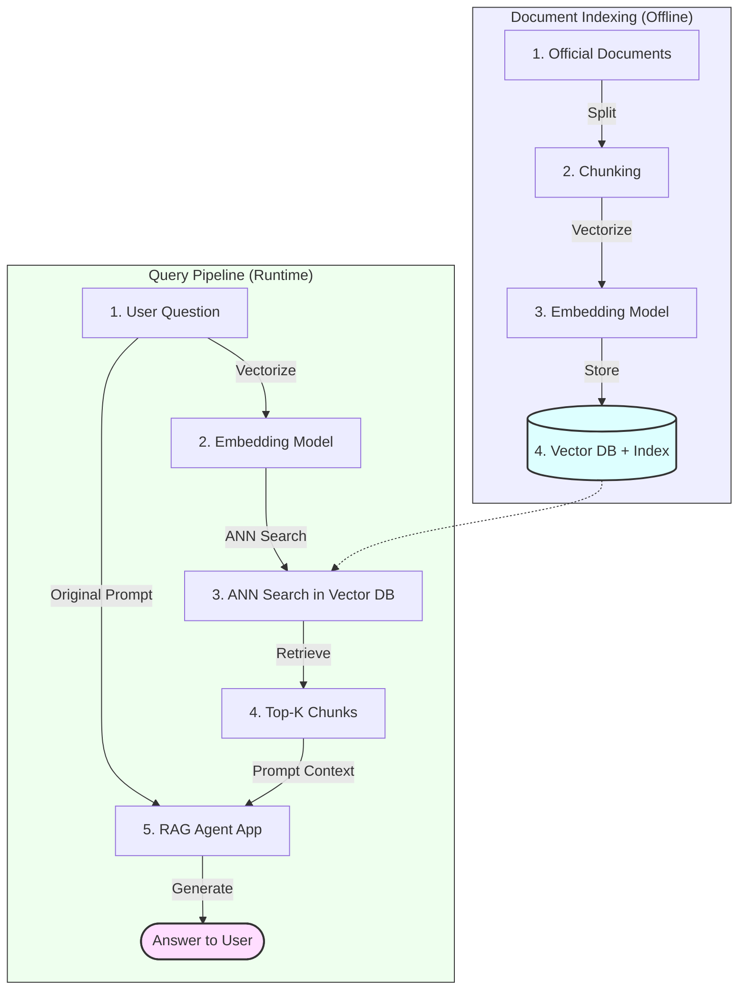

# Problem Statement: Mutual Fund FAQ Assistant (Facts-Only Q&A)

> **Context**: Groww Reference Product Context  
> **Milestone**: Milestone - 2 RAG  

---

## 📌 Overview

The objective of this project is to build a **facts-only FAQ assistant** for mutual fund schemes, using **Groww** as the reference product context. The assistant will answer objective, verifiable queries related to mutual funds by retrieving information exclusively from official public sources, such as AMC (Asset Management Company) websites, AMFI, and SEBI. 

The system must strictly avoid providing investment advice, opinions, or recommendations. Every response must include a single, clear source link and adhere to defined constraints around clarity, accuracy, and compliance.

> [!IMPORTANT]
> **Strict Compliance Requirement**
> The system must **never** provide financial advice, performance comparisons, or investment recommendations. It must remain a purely informative, retrieval-backed utility.

---

## 🎯 Objectives

Design and implement a lightweight **Retrieval-Augmented Generation (RAG)-based** assistant that:
1. **Answers Factual Queries**: Responds to objective queries about mutual fund schemes.
2. **Uses a Curated Corpus**: Leverages a reliable, official set of documents/URLs.
3. **Provides Source-Backed Responses**: Ensures transparency by citing direct official sources.

### 👥 Target Users
* **Retail Investors**: Individuals looking to compare mutual fund scheme details objectively.
* **Customer Support & Content Teams**: Internal teams handling repetitive, factual mutual fund queries.

---

## 🛠️ System Architecture (RAG Pipeline)

The system leverages an end-to-end vector similarity search pipeline consisting of an **Offline Document Indexing Pipeline** and a **Runtime Query Pipeline**:

---

## 📝 Scope of Work

### 1. Corpus Definition
The primary focus is **Groww Mutual Fund** as the selected AMC. We have curated a high-quality corpus of **34 official mutual fund scheme URLs** on Groww to train and evaluate the RAG assistant. 

These include specific Groww Mutual Fund schemes alongside top-tier, highly queried schemes on the Groww platform:

#### 📈 Groww Mutual Fund Schemes (AMC Specific)
1. **Groww Large Cap Fund**: [groww-large-cap-fund-direct-growth](https://groww.in/mutual-funds/groww-large-cap-fund-direct-growth)
2. **Groww Small Cap Fund**: [groww-small-cap-fund-direct-growth](https://groww.in/mutual-funds/groww-small-cap-fund-direct-growth)
3. **Groww Multicap Fund**: [groww-multicap-fund-direct-growth](https://groww.in/mutual-funds/groww-multicap-fund-direct-growth)
4. **Groww Value Fund**: [groww-value-fund-direct-growth](https://groww.in/mutual-funds/groww-value-fund-direct-growth)
5. **Groww ELSS Tax Saver Fund**: [groww-elss-tax-saver-fund-direct-growth](https://groww.in/mutual-funds/groww-elss-tax-saver-fund-direct-growth)
6. **Groww Aggressive Hybrid Fund**: [groww-aggressive-hybrid-fund-direct-growth](https://groww.in/mutual-funds/groww-aggressive-hybrid-fund-direct-growth)
7. **Groww Arbitrage Fund**: [groww-arbitrage-fund-direct-growth](https://groww.in/mutual-funds/groww-arbitrage-fund-direct-growth)
8. **Groww Banking & Financial Services Fund**: [groww-banking-financial-services-fund-direct-growth](https://groww.in/mutual-funds/groww-banking-financial-services-fund-direct-growth)
9. **Groww Liquid Fund**: [groww-liquid-fund-direct-growth](https://groww.in/mutual-funds/groww-liquid-fund-direct-growth)
10. **Groww Overnight Fund**: [groww-overnight-fund-direct-growth](https://groww.in/mutual-funds/groww-overnight-fund-direct-growth)
11. **Groww Dynamic Bond Fund**: [groww-dynamic-bond-fund-direct-growth](https://groww.in/mutual-funds/groww-dynamic-bond-fund-direct-growth)
12. **Groww Short Duration Fund**: [groww-short-duration-fund-direct-growth](https://groww.in/mutual-funds/groww-short-duration-fund-direct-growth)
13. **Groww Nifty Total Market Index Fund**: [groww-nifty-total-market-index-fund-direct-growth](https://groww.in/mutual-funds/groww-nifty-total-market-index-fund-direct-growth)
14. **Groww Nifty Smallcap 250 Index Fund**: [groww-nifty-smallcap-250-index-fund-direct-growth](https://groww.in/mutual-funds/groww-nifty-smallcap-250-index-fund-direct-growth)
15. **Groww Nifty India Railways PSU Index Fund**: [groww-nifty-india-railways-psu-index-fund-direct-growth](https://groww.in/mutual-funds/groww-nifty-india-railways-psu-index-fund-direct-growth)
16. **Groww Nifty India Defence ETF FoF**: [groww-nifty-india-defence-etf-fof-direct-growth](https://groww.in/mutual-funds/groww-nifty-india-defence-etf-fof-direct-growth)
17. **Groww Nifty EV & New Age Automotive ETF FoF**: [groww-nifty-ev-new-age-automotive-etf-fof-direct-growth](https://groww.in/mutual-funds/groww-nifty-ev-new-age-automotive-etf-fof-direct-growth)
18. **Groww Nifty Non-Cyclical Consumer Index Fund**: [groww-nifty-non-cyclical-consumer-index-fund-direct-growth](https://groww.in/mutual-funds/groww-nifty-non-cyclical-consumer-index-fund-direct-growth)
19. **Groww Nifty Private Bank Index Fund**: [groww-nifty-private-bank-index-fund-direct-growth](https://groww.in/mutual-funds/groww-nifty-private-bank-index-fund-direct-growth)
20. **Groww Gold ETF FoF**: [groww-gold-etf-fof-direct-growth](https://groww.in/mutual-funds/groww-gold-etf-fof-direct-growth)
21. **Groww Silver ETF FoF**: [groww-silver-etf-fof-direct-growth](https://groww.in/mutual-funds/groww-silver-etf-fof-direct-growth)
22. **Groww BSE Power ETF FoF**: [groww-bse-power-etf-fof-direct-growth](https://groww.in/mutual-funds/groww-bse-power-etf-fof-direct-growth)
23. **Groww Nifty 200 ETF FoF**: [groww-nifty-200-etf-fof-direct-growth](https://groww.in/mutual-funds/groww-nifty-200-etf-fof-direct-growth)

#### 🚀 Popular Mutual Fund Schemes on Groww Platform
24. **Parag Parikh Flexi Cap Fund (Long Term Value)**: [parag-parikh-long-term-value-fund-direct-growth](https://groww.in/mutual-funds/parag-parikh-long-term-value-fund-direct-growth)
25. **Nippon India Small Cap Fund**: [nippon-india-small-cap-fund-direct-growth](https://groww.in/mutual-funds/nippon-india-small-cap-fund-direct-growth)
26. **Quant Small Cap Fund**: [quant-small-cap-fund-direct-plan-growth](https://groww.in/mutual-funds/quant-small-cap-fund-direct-plan-growth)
27. **Quant Mid Cap Fund**: [quant-mid-cap-fund-direct-growth](https://groww.in/mutual-funds/quant-mid-cap-fund-direct-growth)
28. **Quant Infrastructure Fund**: [quant-infrastructure-fund-direct-growth](https://groww.in/mutual-funds/quant-infrastructure-fund-direct-growth)
29. **HDFC Mid-Cap Opportunities Fund**: [hdfc-mid-cap-opportunities-fund-direct-growth](https://groww.in/mutual-funds/hdfc-mid-cap-opportunities-fund-direct-growth)
30. **HDFC Small Cap Fund**: [hdfc-small-cap-fund-direct-growth](https://groww.in/mutual-funds/hdfc-small-cap-fund-direct-growth)
31. **Kotak Midcap Fund**: [kotak-midcap-fund-direct-growth](https://groww.in/mutual-funds/kotak-midcap-fund-direct-growth)
32. **Canara Robeco Large Cap Fund**: [canara-robeco-large-cap-fund-direct-growth](https://groww.in/mutual-funds/canara-robeco-large-cap-fund-direct-growth)
33. **Mirae Asset ELSS Tax Saver Fund**: [mirae-asset-elss-tax-saver-fund-direct-growth](https://groww.in/mutual-funds/mirae-asset-elss-tax-saver-fund-direct-growth)
34. **SBI Contra Fund**: [sbi-contra-fund-direct-growth](https://groww.in/mutual-funds/sbi-contra-fund-direct-growth)

### 2. FAQ Assistant Requirements
The assistant must be capable of handling facts-only queries:

| Query Type | Description / Examples |
| :--- | :--- |
| **Scheme Specifications** | Expense ratio, exit load details, minimum SIP amount, ELSS lock-in period |
| **Classifications** | Riskometer classifications, Benchmark indices |
| **Fund Manager Data** | Fund manager name, educational background, management tenure, other schemes managed |
| **Operational Guidance** | Steps to download account statements or capital gains reports |

> [!NOTE]
> **Output Formatting Rules**
> * Each response is limited to a **maximum of 3 sentences**.
> * Each response must include **exactly one citation link**.
> * Each response must include a footer: `“Last updated from sources: <date>”`.

### 3. Refusal Handling
The assistant must gracefully refuse non-factual or investment advisory queries:
* **Advisory queries** (e.g., *“Should I invest in this fund?”*, *“Which fund is better?”*) must be politely refused.
* **Refusal responses** should:
  1. Be polite and clearly worded.
  2. Reinforce the facts-only limitation.
  3. Provide a relevant educational link (e.g., to an AMFI or SEBI resource).

### 4. User Interface (Minimalist)
A clean, minimal, and user-friendly interface displaying:
* A warm welcome message.
* **Three example questions** to guide the user.
* A highly visible disclaimer: `“Facts-only. No investment advice.”`

---

## 🚫 Constraints & Guardrails

### 🔒 Privacy & Security
> [!CAUTION]
> **Personally Identifiable Information (PII) Restriction**
> The system **must not** collect, store, or process:
> * PAN or Aadhaar numbers
> * Bank account numbers
> * OTPs (One-Time Passwords)
> * Email addresses or phone numbers

### 📊 Content Restrictions
* **No Investment Advice**: Under no circumstances should the system make recommendations.
* **No Performance/Return Calculations**: For performance queries, the system must not calculate or compare returns; instead, it should provide a link to the official factsheet.

### 🔍 Transparency
* Responses must be short, factual, and strictly verifiable.
* Every answer must include a direct source link and the last updated date.

---

## 📦 Expected Deliverables

* **problemstatement.md**: (This file) containing detailed context and objectives.
* **README.md**: Including setup instructions, selected AMC, targeted schemes, architectural overview of the RAG approach, and known limitations.
* **Disclaimer Snippet**: Highly visible `“Facts-only. No investment advice.”` banner within the UI.

---

## 🏆 Success Criteria

* **Accurate Retrieval**: Seamless and precise extraction of factual mutual fund information.
* **Strict Compliance**: Perfect adherence to facts-only responses without advisory bias.
* **Source Citations**: Consistent, active, and correct links provided with every factual answer.
* **Polite Refusals**: Highly robust refusal handling for all subjective/advisory questions.
* **Minimalist UI**: Sleek, clean, and intuitive frontend application.
